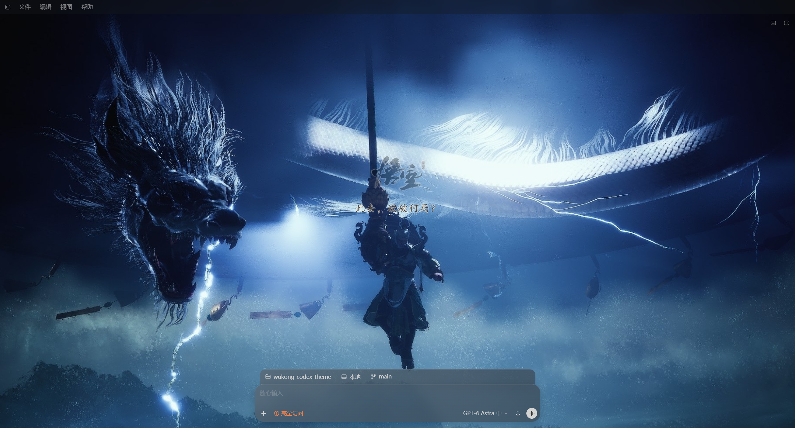
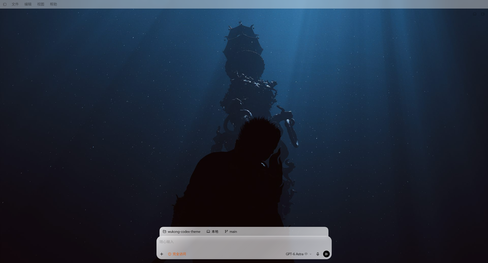

# Wukong Codex Theme

为 Windows ChatGPT/Codex 桌面客户端提供悟空背景与玻璃材质，支持深浅色主题。保留原生布局、文字颜色和交互；10 张战斗图、3 张风景图，对话默认雪山。

## 实机预览

以下为 Windows 桌面客户端实际运行截图，非网页模拟图。截图时侧栏收起，避免展示私人项目与对话；保留完整客户端区域。

**深色主题 · 战斗背景**



**浅色主题 · 玻璃输入框**



## 开始使用

需要已安装的官方 Windows 桌面客户端，无需另外安装 Node.js、Python 或 npm。

1. 在 [Releases](https://github.com/Udkam/wukong-codex-theme/releases) 选择主题运行包 ZIP。GitHub 自动生成的 **Source code** 是开发源码；旧版发行资产可能仍使用旧目录布局。
2. 完整解压到固定文件夹。首次启动前，完全退出 ChatGPT/Codex，包括系统托盘实例。
3. 双击 **start.cmd**。

新的下载包结构：

```text
Wukong-Codex-Theme/
├─ start.cmd       ← 双击这里
├─ 使用说明.txt
└─ app/           ← 必要运行文件，无需打开
```

请保留整个文件夹，不要只复制 start.cmd，也不要直接在压缩包内运行。可为 start.cmd 创建桌面快捷方式。

本次更新只同步源码和打包流程，尚未创建新版 Release。完整操作说明见 [快速开始](docs/QUICK_START.txt)。

## 常用操作

| 操作 | 快捷键 |
| --- | --- |
| 下一张 / 上一张 | Ctrl+Alt+F / Ctrl+Alt+B |
| 切换战斗 / 风景组 | Ctrl+Alt+C |
| 锁定 / 解锁背景 | Ctrl+Alt+K |
| 显示 / 隐藏新对话题字 | Ctrl+Alt+T |

新对话使用战斗组，对话和项目页使用风景组。背景不会定时自动轮播。

## 没有出现主题？

- **应用已经开着：** 从系统托盘完全退出，再双击 start.cmd。已有普通进程无法补加主题启动参数。
- **找不到客户端：** 先安装并正常打开一次官方桌面客户端。
- **启动报错：** 错误窗口会保留，复制内容到 [Issues](https://github.com/Udkam/wukong-codex-theme/issues)。
- **恢复原生：** 完全退出后，从官方入口启动 ChatGPT.exe。

主题不修改官方安装文件、账号配置或自动更新策略。start.cmd 每次启动重新查找已安装版本；未来客户端若改变注入接口，仍可能需要主题适配。关闭主题启动的应用后，可删除解压目录；已有账户数据不由主题卸载操作清理。

## 源码与开发

仓库中的 start.cmd 也可直接使用。runtime、scripts、shared、themes 是运行与开发文件；用户下载包会把它们集中到 app 内。

- [开发、测试与打包](docs/DEVELOPMENT.md)
- [文件结构](docs/FILE_INVENTORY.md)
- [深浅色设计](docs/THEME_COMPARISON.md)
- [验证记录](docs/VALIDATION.md)
- [资源来源](docs/ASSET_SOURCES.md)

仓库当前分支仅保留主题。宠物制作资料、旧截图和弃用设计已退出版本跟踪，本地副本保留；Git 历史未重写。
