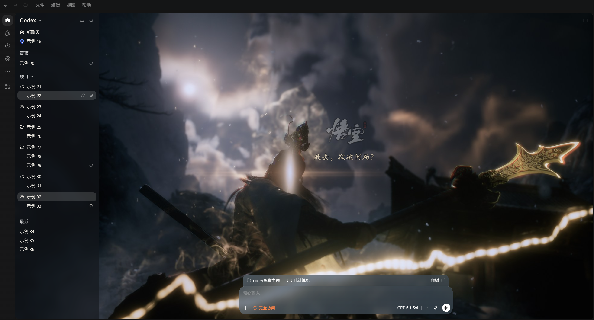
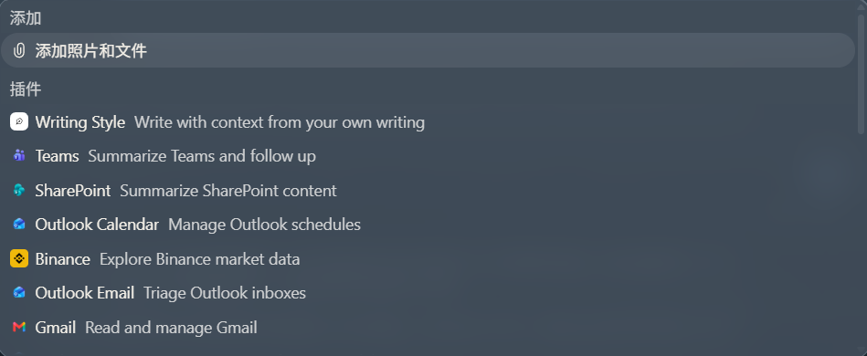
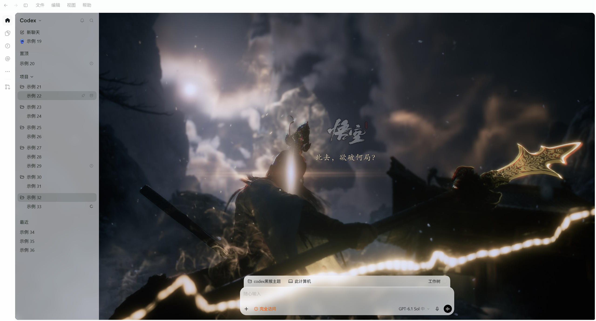
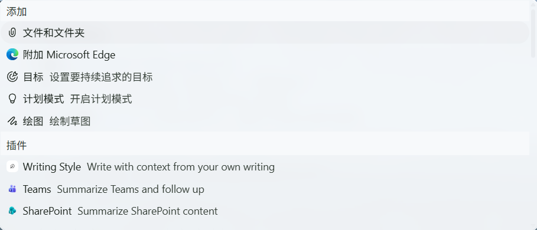

# Wukong Codex Theme

为 Windows ChatGPT/Codex 桌面客户端提供悟空背景与玻璃材质，支持深浅色主题。保留原生交互，按区域替换材质；10 张战斗图、3 张风景图，对话默认雪山。

## v0.18.0：原生表面适配重构

**v0.18.0（2026-10-04，运行时 v108）** 对照 Windows Codex **26.930.3930.0** 的原生 UI，集中维护容器识别和材质配置。本版运行包包含本轮适配与修复。

- **容器随原生变化：** 优先按 `data-*` 所属关系识别壁纸、侧栏、输入区、进度区和摘要面板，减少对固定尺寸、工具类组合及文案的依赖。
- **主题功能继续保留：** 背景队列、自动场景切换、锁定、前后切换、题字开关、深浅玻璃和设置往返复用均保留。
- **材质可配置：** 主题 JSON 的 `materials.dark/light` 可调整玻璃填充、模糊、导航与阅读颜色；已有 schemaVersion 3 导出仍可加载。
- **添加面板：** 分组标题、提示文字与滚动内容使用一致材质，保持原生选择、禁用、滚动和键盘操作。
- **权限表与 dots：** 浏览器智能体权限表使用配套深浅色底色，保留固定列和横向翻页；dots 输入区后方的装饰渐变已清除。
- **清理现役源码：** 移除失效注入方案、旧纹理、历史截图断言与重复说明；仍有效的回归保护迁移到当前结构。Git 历史及已发布版本保留。

### 当前预览

以下为当前客户端的新聊天页和局部截图。新聊天页的侧栏名称已临时替换为示例文本，截图后立即恢复；预览不包含聊天正文。完整来源、模式和验证边界见 [预览说明](docs/previews/README.md)。

**深色**






**浅色**






详细设计见 [原生表面与材质接口](docs/native-surface-adaptation.md)，实机与自动检查结果见 [验证记录](docs/VALIDATION.md)。原生组件若更换语义接口，仍需维护映射；本轮减少的是替换代码对布局细节的依赖。
## 开始使用

需要已安装的官方 Windows 桌面客户端，无需另外安装 Node.js、Python 或 npm。

1. 下载 [v0.18.0 Windows 运行包](https://github.com/Udkam/wukong-codex-theme/releases/download/v0.18.0/Wukong-Codex-Theme-0.18.0-Windows.zip)。请选择此运行包，GitHub 自动生成的 **Source code** 是开发源码。
2. 完整解压到固定文件夹。首次启动前，完全退出 ChatGPT/Codex，包括系统托盘实例。
3. 双击 **start.cmd**。

新的下载包结构：

```text
Wukong-Codex-Theme/
├─ start.cmd       ← 双击这里
├─ 使用说明.txt
└─ app/           ← 必要运行文件，无需打开
```

请保留整个文件夹，不要只复制 start.cmd，也不要直接在压缩包内运行。可为 start.cmd 创建桌面快捷方式。

当前正式版本为 **v0.18.0**。完整操作说明见 [快速开始](docs/QUICK_START.txt)。

## 常用操作

| 操作 | 快捷键 |
| --- | --- |
| 下一张 / 上一张 | Ctrl+Alt+F / Ctrl+Alt+B |
| 切换战斗 / 风景组 | Ctrl+Alt+C |
| 锁定 / 解锁背景 | Ctrl+Alt+K |
| 显示 / 隐藏新对话题字 | Ctrl+Alt+T |

新对话使用战斗组，对话和项目页使用风景组。背景不会定时自动轮播。

## 没有出现主题？

- **应用已经开着：** 从系统托盘完全退出，再双击 start.cmd。已有普通进程无法补加主题启动参数。
- **找不到客户端：** 先安装并正常打开一次官方桌面客户端。
- **启动报错：** 错误窗口会保留，复制内容到 [Issues](https://github.com/Udkam/wukong-codex-theme/issues)。
- **恢复原生：** 完全退出后，从官方入口启动 ChatGPT.exe。

主题不修改官方安装文件、账号配置或自动更新策略。start.cmd 每次启动重新查找已安装版本；未来客户端若改变注入接口，仍可能需要主题适配。关闭主题启动的应用后，可删除解压目录；已有账户数据不由主题卸载操作清理。

## 源码与开发

仓库中的 start.cmd 也可直接使用。runtime、scripts、shared、themes 是运行与开发文件；用户下载包会把它们集中到 app 内。

- [开发、测试与打包](docs/DEVELOPMENT.md)
- [文件结构](docs/FILE_INVENTORY.md)
- [原生表面与材质接口](docs/native-surface-adaptation.md)
- [验证记录](docs/VALIDATION.md)
- [资源来源](docs/ASSET_SOURCES.md)

仓库当前分支仅保留主题。宠物制作资料、旧诊断和 Archives 存档已退出当前源码和运行包；本轮复查旧归档与旧待删除目录均已不存在；新产生且删除受阻的重复副本已另行集中供手动删除。历史迁移与本机清理记录见 [清理记录](docs/CLEANUP.md)。
