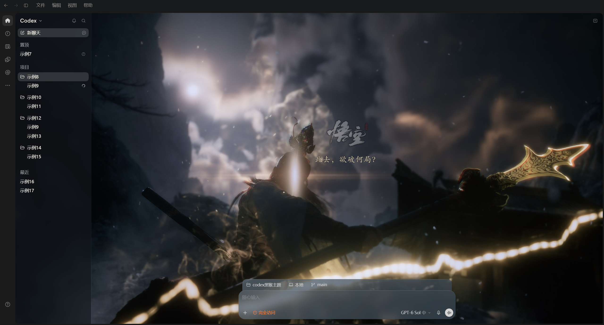
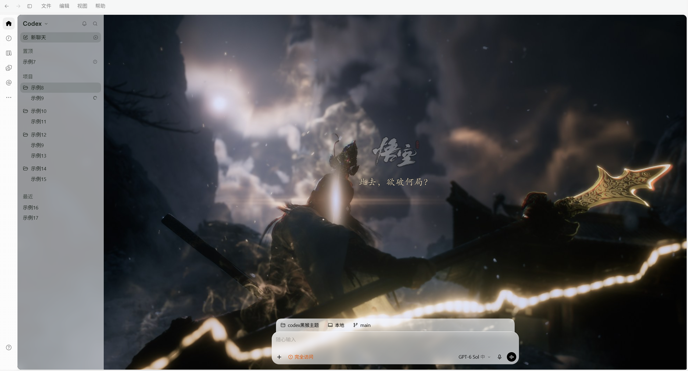
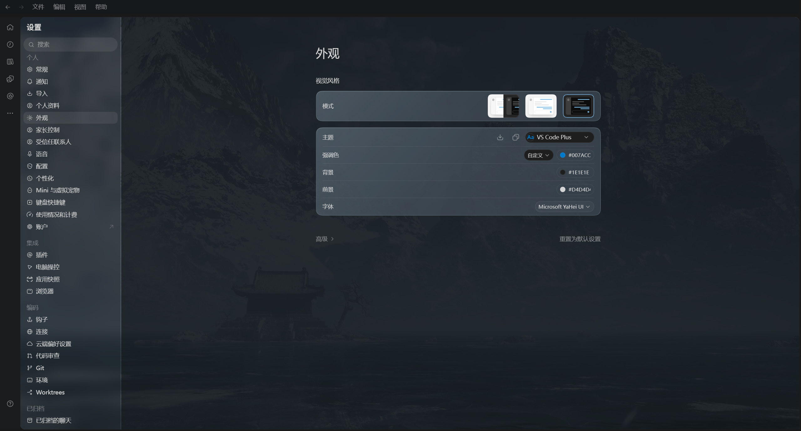
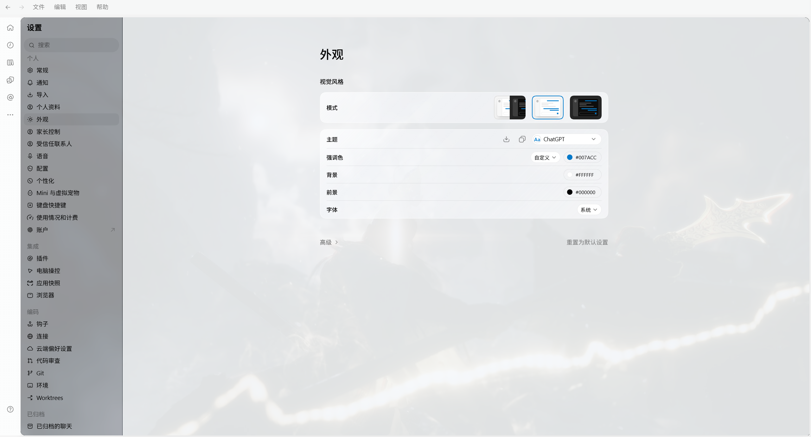

# Wukong Codex Theme

为 Windows ChatGPT/Codex 桌面客户端提供悟空背景与玻璃材质，支持深浅色主题。沿用原生布局与交互，按表面匹配阅读底色；10 张战斗图、3 张风景图，对话默认雪山。

## 新版 UI

**v0.17.2 修复（2026-10-02，已验收）**：进入 dots 对话自动使用风景图队列，包括尚无消息的对话；隐藏的 dots 页面不影响首页战斗图。保留背景锁定优先级。v0.17.2 包含此修改。


**v0.17.0** 适配 Windows Codex **26.924.2738.0**：背景跟随原生页面范围与圆角，双侧栏分别填充材质，设置往返复用已解码背景。资料库、图像、Plugins 和 Skills 的标题与阅读背景同步适配。

**v0.17.1 修复（2026-10-01，已验收）**：适配 **26.928.2636.0** 新增的聊天底部纯色层、滚动渐变及 Your dot 消息页背景／标题渐变。沿用原生布局，保留输入框玻璃材质和消息控件。v0.17.1 下载包包含本次修复。

### 实机预览

**26.928 修复后的输入区（2026-10-01）**：当前客户端原生深浅模式切换后截取，展示底部背景连续性；不包含聊天正文。


以下全窗口截图为已发布 v0.17.0 在 26.924 上的历史效果，不代表 26.928 修复验收。侧栏名称已替换为示例、头像已隐藏；未合成或重绘界面。

**深色 · 新对话**



**浅色 · 新对话**



<details>
<summary>查看深浅色设置页</summary>





</details>

详见 [原生容器映射](docs/native-surface-adaptation.md) 与 [验证记录](docs/VALIDATION.md)。原生 UI 后续若改变组件结构，仍可能需要适配。

## 开始使用

需要已安装的官方 Windows 桌面客户端，无需另外安装 Node.js、Python 或 npm。

1. 下载 [v0.17.2 Windows 运行包](https://github.com/Udkam/wukong-codex-theme/releases/download/v0.17.2/Wukong-Codex-Theme-0.17.2-Windows.zip)。请选择此运行包，GitHub 自动生成的 **Source code** 是开发源码。
2. 完整解压到固定文件夹。首次启动前，完全退出 ChatGPT/Codex，包括系统托盘实例。
3. 双击 **start.cmd**。

新的下载包结构：

```text
Wukong-Codex-Theme/
├─ start.cmd       ← 双击这里
├─ 使用说明.txt
└─ app/           ← 必要运行文件，无需打开
```

请保留整个文件夹，不要只复制 start.cmd，也不要直接在压缩包内运行。可为 start.cmd 创建桌面快捷方式。

当前正式版本为 **v0.17.2**。完整操作说明见 [快速开始](docs/QUICK_START.txt)。

## 常用操作

| 操作 | 快捷键 |
| --- | --- |
| 下一张 / 上一张 | Ctrl+Alt+F / Ctrl+Alt+B |
| 切换战斗 / 风景组 | Ctrl+Alt+C |
| 锁定 / 解锁背景 | Ctrl+Alt+K |
| 显示 / 隐藏新对话题字 | Ctrl+Alt+T |

新对话使用战斗组，对话和项目页使用风景组。背景不会定时自动轮播。

## 没有出现主题？

- **应用已经开着：** 从系统托盘完全退出，再双击 start.cmd。已有普通进程无法补加主题启动参数。
- **找不到客户端：** 先安装并正常打开一次官方桌面客户端。
- **启动报错：** 错误窗口会保留，复制内容到 [Issues](https://github.com/Udkam/wukong-codex-theme/issues)。
- **恢复原生：** 完全退出后，从官方入口启动 ChatGPT.exe。

主题不修改官方安装文件、账号配置或自动更新策略。start.cmd 每次启动重新查找已安装版本；未来客户端若改变注入接口，仍可能需要主题适配。关闭主题启动的应用后，可删除解压目录；已有账户数据不由主题卸载操作清理。

## 源码与开发

仓库中的 start.cmd 也可直接使用。runtime、scripts、shared、themes 是运行与开发文件；用户下载包会把它们集中到 app 内。

- [开发、测试与打包](docs/DEVELOPMENT.md)
- [文件结构](docs/FILE_INVENTORY.md)
- [深浅色设计](docs/THEME_COMPARISON.md)
- [验证记录](docs/VALIDATION.md)
- [资源来源](docs/ASSET_SOURCES.md)

仓库当前分支仅保留主题。宠物制作资料、旧截图和弃用设计已退出版本跟踪，本地副本保留；Git 历史未重写。
